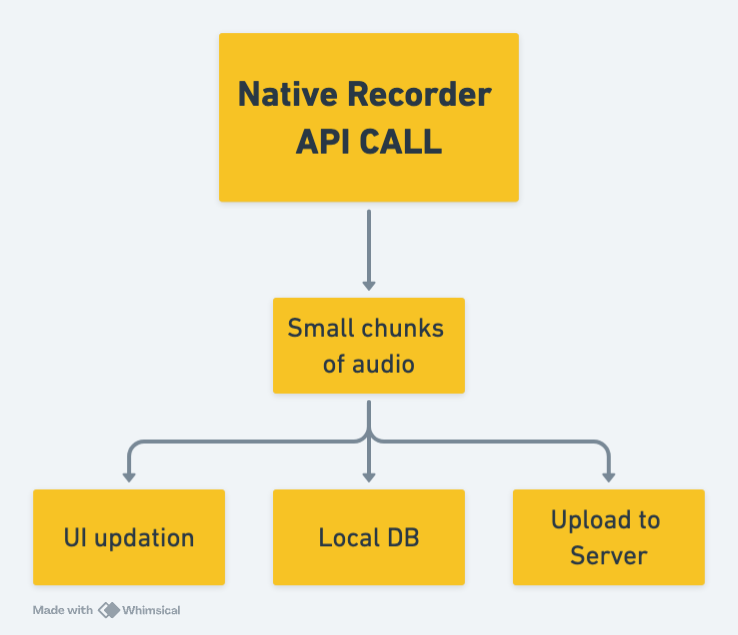
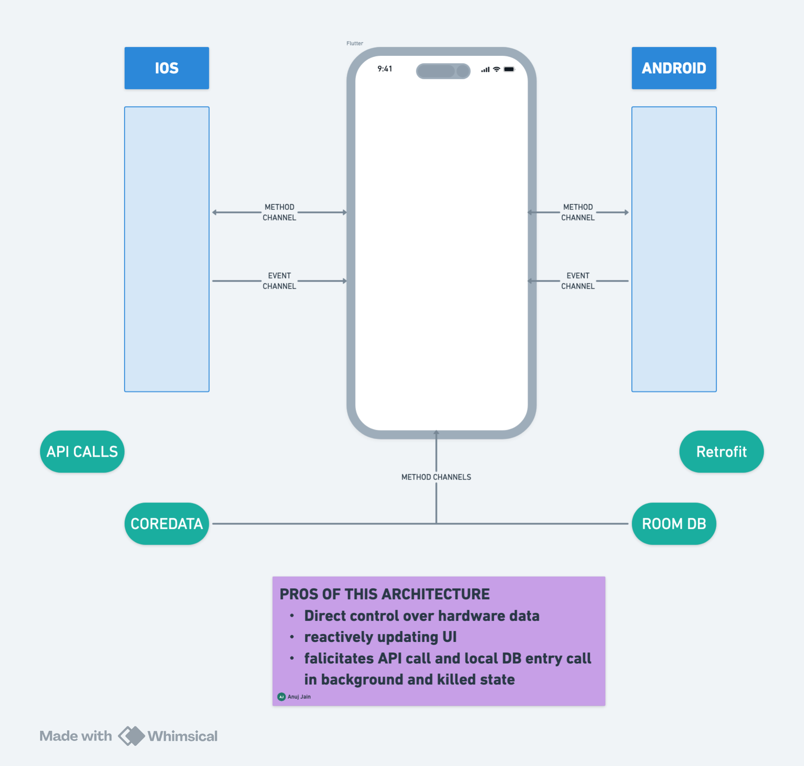

# Dr Logger

A doctor's companion for mainitaining the medical logs of their patients.

## Download APK file from Google Drive 📥

[](https://drive.google.com/file/d/1crCKJvVbP1DZuCMebjEg0rZOMvWZJy0L/view?usp=sharing)

---

## Features

- Record audio while app is in background.
- Real time speech recognition transcription.

## Setup Instructions

### Prerequisites

- Flutter 3.29.3
- Dart 3.7.2

### Packages used
```bash
dependencies:
  flutter:
    sdk: flutter
  permission_handler: ^11.3.1
  intl:
  random_avatar: ^0.0.8
  url_launcher: ^6.3.2
```

### Clone the Repository
```bash
git clone https://github.com/anujjainwork/ai-scribe-copilot.git
cd ai-scribe-copilot
```

### Install Dependencies
```bash
flutter pub get
```

### Run the Application
```bash
flutter run
```

### App testing youtubevideo

[](https://www.youtube.com/watch?v=sQ7g93b4LMM)

### Solution architecture loom video
[](https://www.loom.com/share/9054c1b8698242d78883b3f563f96de7)

### High level architecture


---

### Contributions
All credits go to @anujjainwork (Github profile)
---
